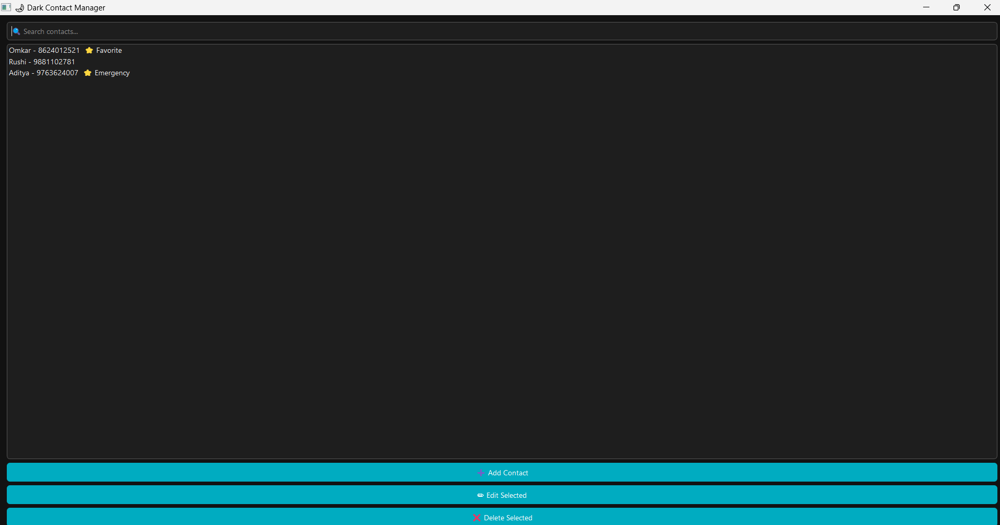

# 🧊 Dark Contact Manager (PyQt5)

A stylish, modern contact manager built with **Python** and **PyQt5**. Easily add, edit, delete, and search contacts with a sleek **dark mode interface**, real-time filtering, and tagging support like ⭐ Favorites or 🚨 Emergency.




## ✨ Features

- 📋 View all saved contacts in a sleek Listbox
- 🔍 Real-time search bar
- ➕ Add new contacts with full details (name, number, email, DOB, tag)
- ✏️ Edit existing contacts with a modal form
- ❌ Delete selected contact with confirmation
- ⭐ Support for tags like "Favorite" or "Emergency"
- 🌙 Beautiful dark theme with teal accents

## 📦 Technologies

- Python 3.x
- PyQt5

## 🚀 Getting Started

### Prerequisites
Make sure you have Python and PyQt5 installed:
```bash


pip install pyqt5

python contact_manager.py


contact_manager/
│
├── contact_manager.py   # Main GUI application
├── README.md            # Project readme

